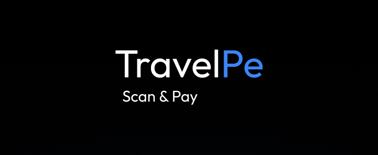

<p align="center">
  
</p>

<p align="center">
  <strong>Pay any UPI merchant in India with a USD stablecoin.</strong><br />
  An Android-first payment app for international travellers, built on the Tempo.
</p>

<p align="center">
  <a href="#overview">Overview</a> ·
  <a href="#how-it-works">How it works</a> ·
  <a href="#getting-started">Getting started</a> ·
  <a href="#documentation">Documentation</a> ·
  <a href="#contributing">Contributing</a>
</p>

---

> [!IMPORTANT]
> TravelPe is at prototype stage right now. Payments use free Tempo **testnet** tokens with no monetary value. Conversion to INR and payout to the merchant over UPI are **simulated**: no real money moves, and every receipt states this.

## Overview

UPI is accepted by almost every merchant in India, from retail stores to street vendors, but it requires an Indian bank account. International travellers are left relying on cash or on cards with high foreign exchange fees.

TravelPe lets a traveller scan a merchant's existing UPI QR code, review the amount in INR, and pay from their own wallet in a USD stablecoin. Merchants keep their current QR code and do not need to install anything.

### Features

- **UPI QR scanning** with the camera or from an image in the gallery
- **Multiple stablecoins:** pay with USDC, USDT or pathUSD
- **Self-custody:** sign in with MetaMask; keys never leave the wallet
- **Tap to pay:** a single wallet approval enables PIN-confirmed payments up to a daily limit
- **Device security:** payment PIN plus biometric or passcode unlock
- **Activity and receipts** with clearly labelled simulated settlement

## How it works

1. **Connect a wallet.** The traveller signs in with MetaMask and sets a 4-digit payment PIN.
2. **Scan the QR code.** TravelPe reads the merchant name, UPI ID and INR amount.
3. **Review the payment.** The traveller chooses a stablecoin and confirms the amount.
4. **Approve with the PIN.** The stablecoin payment is submitted on the Tempo testnet.
5. **Settle and record.** INR settlement to the merchant is simulated, and the payment appears in activity with a receipt.

### Repository structure

| Path                                 | Description                                                                         |
| ------------------------------------ | ----------------------------------------------------------------------------------- |
| [`apps/mobile`](apps/mobile)         | Expo (React Native) app: onboarding, wallet sign-in, scanner, payments and activity |
| [`apps/api`](apps/api)               | Node.js API: health check, wallet sign-in and UPI QR parsing                        |
| [`packages/shared`](packages/shared) | Shared Zod schemas, UPI and TravelPe QR parsers, payment statuses                   |
| [`docs`](docs)                       | Architecture, roadmap and wallet testing guides                                     |

## Getting started

### Prerequisites

- Node.js 24.13 or later (24.x) and pnpm 12.3.4
- An Android device with Expo Go, or an Android emulator
- MetaMask Mobile with a **disposable** test wallet for wallet mode. Do not use a wallet that holds real funds.

### Installation

```sh
pnpm install
cp .env.example .env
pnpm --filter @traveller/shared build
```

### Running with a wallet

Start the API (port 3000) and the mobile app together:

```sh
pnpm dev
```

They can also be started separately with `pnpm dev:api` and `pnpm dev:mobile`. Scan the Expo QR code with an Android device, or press `a` to open the emulator.

To submit testnet payments, set the Tempo testnet address that receives them, such as a second MetaMask account you control:

```sh
EXPO_PUBLIC_SETTLEMENT_ADDRESS=0xYourTestnetAddress pnpm dev:mobile
```

Then enable **Tap to pay** in Profile. A single MetaMask approval allows TravelPe to pay from your account, only to that address and up to a daily limit, without reopening MetaMask for each payment. Funds remain in your wallet until a payment is made. The [wallet testing guide](docs/WALLET_TESTING.md) explains how to obtain testnet tokens from the faucet.

### Running in preview mode

Preview mode runs the full interface without a wallet. It uses a sample balance and sample transactions; payments are simulated and stored only on the device.

```sh
pnpm dev:mobile:android-preview   # Android, in Expo Go
pnpm dev:mobile:ios-preview       # iOS Simulator, in Expo Go
```

- **Android:** tap **Get Started**, then **Continue**, and set a 4-digit PIN.
- **iOS:** on the onboarding screen, tap **Continue to Dashboard**.

The **UI preview** bar at the bottom of the screen steps through the payment flow, including the success and failure states. To reset, tap **Forgot PIN?** on the PIN screen and select **Reset preview**. Stop any running Expo server before starting preview mode.

## Security

- Payments require a 4-digit PIN, stored on the device only as a salted hash.
- The app is unlocked with the device's biometrics or passcode, which are handled entirely by the operating system.
- The app locks again after 30 seconds or more in the background.
- Private keys and recovery phrases remain in MetaMask and never reach the app, the API or this repository.
- Merchant names, amounts and QR fields are treated as untrusted input and validated against shared schemas.

## Documentation

| Document                                   | Contents                                                  |
| ------------------------------------------ | --------------------------------------------------------- |
| [Architecture](docs/ARCHITECTURE.md)       | System design, payment and settlement flow, key decisions |
| [Roadmap](docs/ROADMAP.md)                 | Build plan and delivery status                            |
| [Wallet testing](docs/WALLET_TESTING.md)   | MetaMask setup, testnet funding and acceptance checks     |
| [API reference](apps/api/README.md)        | QR parsing endpoint, request and response formats         |
| [Design guidelines](apps/mobile/DESIGN.md) | Visual language, layout and screen guidelines             |
| [Product brief](apps/mobile/PRODUCT.md)    | Target users and product purpose                          |
| [MetaMask SDK patch](patches/README.md)    | Reason for the SDK patch and the behaviour it changes     |

## Contributing

Contributions, bug reports and feature requests are welcome. For significant changes, please open an issue first to discuss the approach.

1. Fork the repository and create a branch from `main`.
2. Review the [architecture](docs/ARCHITECTURE.md) and, for interface changes, the [design guidelines](apps/mobile/DESIGN.md).
3. Ensure changes work in both wallet mode and preview mode. Wallet mode must display only real data.
4. Run the checks below and confirm they pass.
5. Open a pull request that describes the change and how it was tested. Include screenshots for interface changes.

```sh
pnpm typecheck
pnpm lint
pnpm test
pnpm format:check
pnpm build
```

Never commit private keys, recovery phrases or other credentials.

## Limitations

- **Testnet only:** all stablecoins are Tempo testnet tokens with no monetary value.
- **Simulated settlement:** no stablecoin is sold and no INR reaches a merchant. No production off-ramp, KYC/AML, banking or UPI provider is integrated.
- **Local history:** transaction history is not yet persisted on a server.
- **Distribution:** the app is not published on app stores, and support for other chains is out of scope.

Converting stablecoins to INR may be a regulated activity and would require licensed partners before real funds could be moved.
