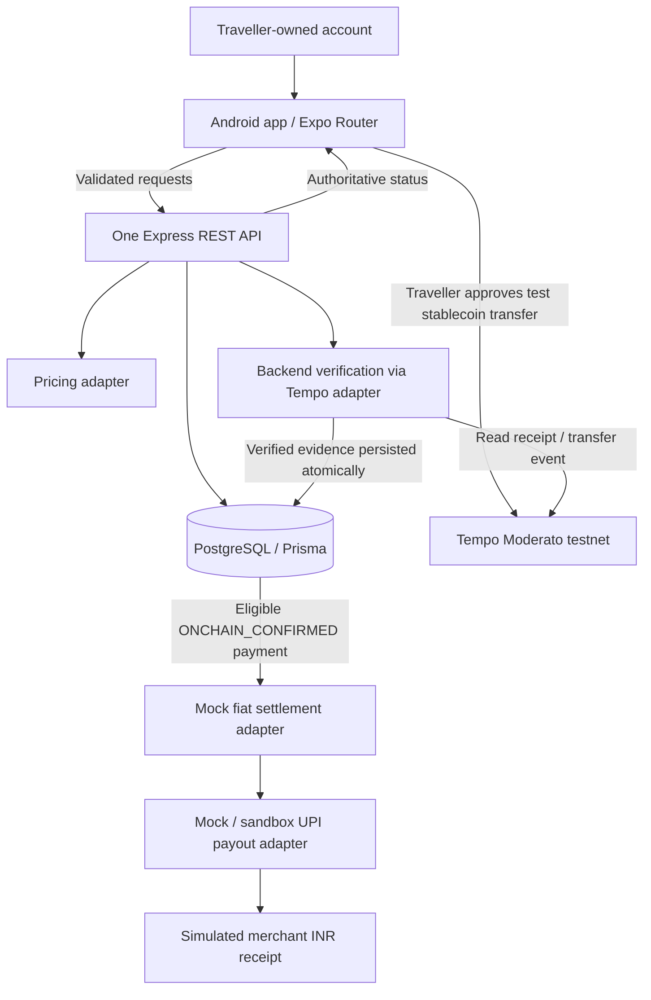
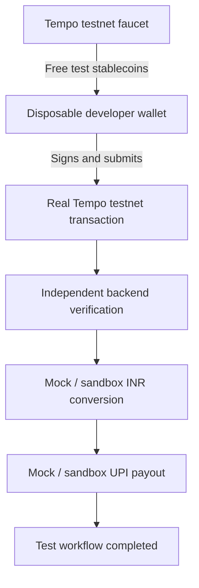
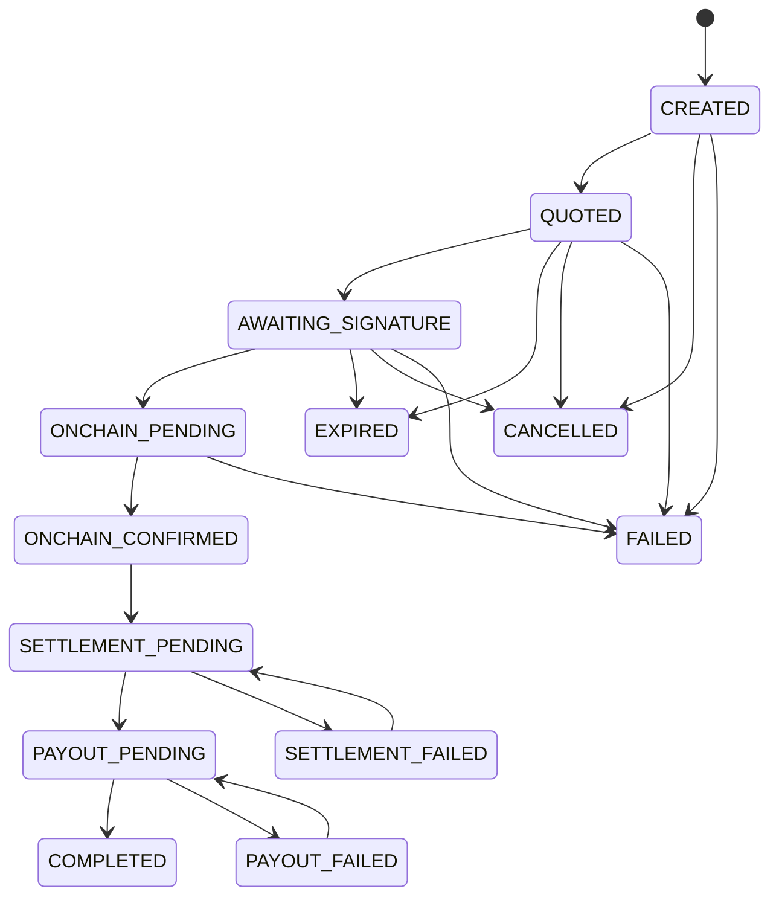
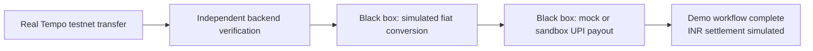
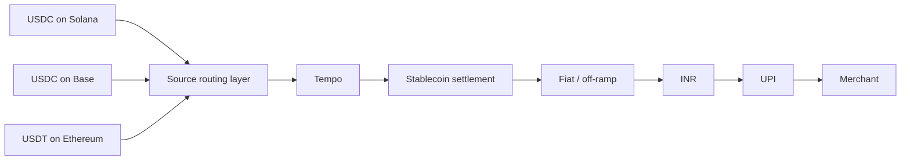

# Architecture — traveller payments on Tempo

Canonical engineering specification. Build window: **September 15–October 4, 2026 (20 calendar days)**. Changes to scope must also update [ROADMAP.md](ROADMAP.md). This is a hackathon prototype, not a production payment service.

**Active scope — supersedes the earlier documentation-only pause:** the user resumed implementation. QR scanning and backend parsing are merged. The next authorized build connects MetaMask Mobile to Tempo testnet and exposes developer-wallet faucet funding and balances. Keep the existing scanner design unchanged; no broader visual redesign is in scope.

**Implementation status:** the Node standard-library API exposes health and QR parsing. MetaMask connection and a public Tempo RPC balance/faucet adapter are implemented in the mobile app. Physical Android wallet compatibility and live funding still require acceptance testing. Backend authentication, payment submission/verification and database wiring remain unfinished. This is not a decision to replace the proposed Express service.

**Approved settlement mode — September 15, 2026:** continue the MVP in test mode using the settlement/payout black box. The intended blockchain leg is a real Tempo testnet transaction with independent backend verification. Stablecoin-to-INR conversion and merchant UPI payout remain mock or provider-sandbox operations; they move no real INR. The current account/faucet increment does not implement those payment operations.

**Approved local-development funding path — September 15, 2026:** use a disposable developer-controlled wallet funded with free Tempo testnet faucet assets. The wallet signs a real Tempo testnet transfer, which the backend independently verifies before the mock/sandbox settlement flow runs. No team member needs to own mainnet Tempo assets, and faucet assets have no monetary value. Wallet secrets remain only in the selected wallet application and must never enter this repository, the mobile app source or the backend.

### Decision approval policy

Requirements explicitly fixed in the product brief remain constraints: Tempo-first, Android-first, React Native/TypeScript, no custom custody, no production INR movement, no multichain implementation, and the September 15–October 4 window. The user selected MetaMask Mobile and a disposable developer-controlled faucet-funded wallet. This increment uses pathUSD solely for the initial faucet/balance test; final payment-token selection, fee-payer strategy, backend/database choice, receiving-account arrangement and pricing remain pending. Record material user decisions here; a scaffold file or elapsed time does not count as approval.

## 1. Product goal

Travellers arriving in India use an existing Tempo-compatible account to pay from USD stablecoin balances by scanning a merchant's existing UPI QR. They see the merchant, INR amount, stablecoin equivalent, and an approval action. Tempo carries the real testnet payment; the backend independently verifies it before invoking simulated INR settlement. The merchant needs no new application, and the traveller needs no Indian bank or UPI account. The MVP demonstrates a payment abstraction layer, not a custodial wallet.

## 2. Core journey

Connect/authenticate Tempo account → inspect supported balances → scan UPI QR → enter/confirm INR amount → obtain expiring quote → approve transfer → Tempo confirmation → mock fiat settlement → mock UPI payout → receipt.

Main payment screens emphasize merchant, ₹ amount, USD stablecoin, and progress. Network, addresses, memo, hash, and explorer link belong under transaction details. Every demo receipt must explicitly say **“INR settlement simulated — no bank transfer”**. A real Tempo test transaction does not imply real INR movement.

## 3. MVP boundaries

Included: Android-first React Native/Expo Router shell, account integration, one supported USD test stablecoin, QR parsing, quotes, real Tempo testnet transfer, independent verification, explicit payment state, mock/sandbox settlement, minimal history and receipts. Initial scaffolding implements infrastructure contracts and small tested domain modules, not the complete journey.

Excluded: production off-ramp/UPI, KYC/AML systems, FIU registration workflows, NPCI/TPAP/PSP onboarding, direct banking, custom custody, merchant application/dashboard, public app-store release, profiles, rewards, referrals, cards, exports, push, analytics, complex administration, bridging, swaps, Solana/SOL and other chain implementations. No Kubernetes, Kafka, Redis, microservices, GraphQL, event sourcing, CQRS, custom indexer or generalized chain framework.

Real stablecoin-to-INR conversion may be regulated. Production requires appropriate VDA/off-ramp/payment-provider partners and a separate compliance assessment. Production KYC/AML and UPI settlement are outside this prototype. This document makes no claim that the prototype authorizes production operation.

## 4. Architecture



The diagram is logical: application services orchestrate adapters. The database does not call providers; no blockchain callback may bypass backend verification. The onchain receiver is not the merchant's VPA. A VPA identifies the simulated INR payout destination.

## 5. Architectural decisions

Status legend: **Required** = selected in the user brief; **Proposed** = awaiting the user's explicit architecture answer; **Implementation rule** = details needed to honor the brief. Do not implement a proposed integration before its answer. Record accepted changes here, not in scattered competing ADRs.

| Decision | Status | Reason | Alternatives considered | Trade-offs |
| --- | --- | --- | --- | --- |
| Tempo is the sole payment network | Required | Core product and demo premise | Solana-first; optional Tempo settlement | Narrow integration surface; source assets must already be on Tempo |
| React Native, TypeScript, Expo, Expo Router | Required | Shared mobile code and fast iteration | Bare React Native; separate native apps | Native wallet modules may require development builds |
| Android first; internal APK/dev build | Required | October 4 deadline | Equal platform effort; public store launch | iOS and store approval deferred |
| TanStack Query; minimal Context state; Zod | Required/implementation rule | Server authority and runtime boundaries | Global client cache/custom validators | Local state only for transient scan/draft data |
| MetaMask Mobile via MetaMask Connect EVM | Approved by user; device validation pending | Developer-controlled wallet, direct native deep links, no app custody | Reown connector; embedded wallet; direct Tempo passkeys | Physical Android connect/switch/return/signing must still be proven |
| pathUSD for the initial faucet/balance test | Scoped implementation assumption; payment-token decision pending | Official faucet test asset; metadata checked at runtime | Other faucet test tokens | Test asset only; no claim of issuer USDC/USDT support |
| Stablecoin-paid fees first; sponsorship after core transfer | Proposed | Removes separate gas token without sponsor infrastructure | Managed sponsor immediately | Reserve funds for fees; wallet might still show fee details |
| REST, Express and one backend service | Proposed from recommended stack | Familiar TypeScript and minimal operations | Fastify; GraphQL; microservices | Some background processing lives in same deployment |
| PostgreSQL + Prisma | Proposed from recommended stack | Durable uniqueness, transactions, restart recovery | SQLite; in-memory database | Local DB setup; schema/migration discipline |
| Integer monetary units; decimal strings over REST | Proposed | Exact arithmetic and JSON-safe amounts | JavaScript floating-point arithmetic | Explicit conversion at boundaries |
| Test-only configured receiver, one transfer per payment | Proposed | No new customer deposit wallet; simple reconciliation | Escrow contract; per-payment receiver | Irreversible test transfer; no automatic refunds |
| Disposable developer wallet funded by the Tempo faucet for local development | **Approved — September 15, 2026** | Exercises a real Tempo testnet transaction without purchasing or owning mainnet assets | Mock blockchain receipt; mainnet assets; backend signer | Faucet availability and testnet resets can interrupt testing; wallet must contain no valuable assets |
| Narrow Tempo/pricing/settlement/payout interfaces | Required | Domain independent of SDK/vendors | SDK calls in business services; universal provider framework | Small mapping layer |
| Test-mode settlement/payout black box | **Approved — September 15, 2026** | Delivers a repeatable end-to-end test without regulated money movement while partner discussions continue | Live off-ramp plus UPI provider; prefunded live payout; provider sandbox | No stablecoin sale or INR transfer occurs; every result must be labelled simulated |
| Mock pricing initially | Proposed | No pricing credentials needed during foundation work | Live FX provider | Fixed demo FX is illustrative, not a market execution rate |
| No multichain implementation | Required | Protect core path | Generalized source routing now | Future source chains documented only |
| No custom custody or private-key storage | Required | Traveller retains signing authority | Server-held customer keys | Established wallet tooling is a dependency |

### Tempo research — inspected September 15, 2026

Official documentation reports **Moderato testnet**, chain ID **42431**, RPC `https://rpc.moderato.tempo.xyz`, websocket `wss://rpc.moderato.tempo.xyz`, explorer `https://explore.tempo.xyz`. Mainnet is not enabled in this scaffold. Source: [connection details](https://docs.tempo.xyz/quickstart/connection-details), corroborated by the [official repository](https://github.com/tempoxyz/tempo). Search-index snapshots may lag live documentation; recheck network configuration before the Week 1 device spike.

The [official faucet](https://docs.tempo.xyz/quickstart/faucet) lists:

| Asset | Testnet address | Standard / decimals | MVP policy |
| --- | --- | --- | --- |
| pathUSD | `0x20c0000000000000000000000000000000000000` | TIP-20 / 6 | Proposed first test USD asset |
| AlphaUSD | `0x20c0000000000000000000000000000000000001` | TIP-20 / 6 | Researched alternative |
| BetaUSD | `0x20c0000000000000000000000000000000000002` | TIP-20 / 6 | Not enabled |
| ThetaUSD | `0x20c0000000000000000000000000000000000003` | TIP-20 / 6 | Not enabled |
| USDC / USDT | Not confirmed for this test environment | Must verify issuer, contract and metadata | No invented addresses or relabelling |

### Approved local-development transaction path



The disposable wallet is a dedicated test account created and controlled through the approved wallet application. It must never hold mainnet funds or be reused as a production, treasury or personal wallet. The application does not generate, import, export or store its private key. Developers obtain faucet assets only from the official Tempo testnet faucet and verify the network, asset contract and chain ID before testing.

The Tempo leg is real within the testnet: a transaction is signed, broadcast, included and independently verified from chain evidence. Everything after `ONCHAIN_CONFIRMED` is simulated or uses a provider sandbox and moves no INR. The final screen must say **“Tempo test payment confirmed — INR settlement simulated”**; it must not claim that the merchant received money. Testnet resets, faucet rate limits and asset unavailability are expected development constraints and must not be bypassed with fabricated Tempo success.

[TIP-20](https://docs.tempo.xyz/protocol/tip20/overview) provides payment-specific stablecoin infrastructure and token policies. [pathUSD metadata](https://docs.tempo.xyz/protocol/exchange/pathUSD) confirms its six decimals. Runtime integration must check chain ID, contract code, symbol, decimals and USD currency against the approved allowlist before enabling an asset. “USD stablecoin (test)” is the friendly label; token details retain the actual symbol. A test asset must never be silently called USDC or USDT.

Tempo is central because the payment itself settles on its stablecoin-oriented network, with TIP-20 transfer evidence used for reconciliation. It offers stablecoin-denominated fees, payment references and protocol-level sponsorship. Its native DEX supports stablecoin interoperability, but the MVP uses a direct transfer, not swaps, routing, bridging, issuance, rewards or custom contracts. [Protocol overview](https://docs.tempo.xyz/protocol), [stablecoin exchange](https://docs.tempo.xyz/guide/stablecoin-dex).

Use the maintained **viem / viem/tempo** TypeScript integration inside infrastructure modules; domain types must not import it. Tempo's examples expose TIP-20 ABIs and actions there. Wagmi examples are browser React integrations, not proof of React Native compatibility. [SDKs](https://docs.tempo.xyz/sdk), [predeployed contracts / ABIs](https://docs.tempo.xyz/quickstart/predeployed-contracts).

**References:** `transferWithMemo(address,uint256,bytes32)` emits a `TransferWithMemo` event. Proposed implementation hashes an opaque payment ID into 32 bytes, stores that memo with the quote and checks the emitted event. No merchant name, VPA or other personal data goes in the memo. Do not truncate a UUID string to fit. [Transfer memos](https://docs.tempo.xyz/guide/payments/transfer-memos).

**Fees:** Tempo has no native gas token. Fee selection can use the transferred USD TIP-20 for eligible direct calls, subject to account/transaction preferences and fee liquidity. The payer needs enough stablecoin for transfer plus the maximum fee. A sponsored Tempo transaction has a separate fee-payer signature; sponsor funding or fee-liquidity failures must stop/retry safely, never report success. Proposed initial payer is the traveller, with a clear total estimate and no separate gas-token onboarding. Sponsorship is a later usability improvement, not implemented in the scaffold. [Fee specification](https://docs.tempo.xyz/protocol/fees/spec-fee), [EVM differences](https://docs.tempo.xyz/quickstart/evm-compatibility).

### Account options and Android acceptance gate

#### MetaMask Mobile selected; Android acceptance pending

The user selected **MetaMask Mobile**. The mobile app uses MetaMask Connect EVM for connection and Tempo network switching; public RPC reads and faucet requests do not use a signer. Physical-device signing compatibility is not established by this increment. Phantom is not offered.

- **MetaMask:** its official support page lists Tempo and documents custom-network setup on Mobile and Extension. This does not prove Moderato is preconfigured in every installed version. [MetaMask networks](https://support.metamask.io/configure/networks/how-to-add-a-custom-network-rpc).
- **Mobile connection:** MetaMask Connect documents React Native EVM support and native-app deep links to MetaMask Mobile. Its current documentation replaces the legacy SDK. This connector is implemented; Moderato signing, app return and reconnect must still be proven on Android. [MetaMask Connect platforms](https://docs.metamask.io/metamask-connect/supported-platforms/), [current connector](https://docs.metamask.io/metamask-connect/).
- **Phantom:** official documentation excludes Tempo from its supported networks and says arbitrary/custom networks cannot be added. An EVM address or a wallet connection alone does not establish Tempo transaction capability. Do not offer Phantom as a working Tempo option or assume WalletConnect adds unsupported chain capability. [Phantom network support](https://help.phantom.com/articles/what-blockchain-networks-does-phantom-support-41372840389651), [custom-network limitation](https://help.phantom.com/articles/can-i-manually-add-a-network-to-phantom-46595961428627).

Target journey: connect MetaMask → read the test token balance on Tempo → scan/quote → approve in MetaMask → return to app → backend verifies Tempo. Only connection, balance and faucet functionality are part of this increment. Connecting a wallet does not move USDC from Ethereum or SOL from Solana. Network-add/switch approvals and wallet fee details may remain visible. Native Tempo sponsorship/passkeys must not be inferred from ordinary EVM signing support.

| Option | Evidence | Implication |
| --- | --- | --- |
| Existing EVM-compatible wallet via Reown React Native | Tempo documents wallet connections; Reown documents RN/Expo connectors, native dependencies, and project ID setup | Alternative considered; direct MetaMask Connect selected for this increment |
| Established embedded provider (Privy) | Privy documents RN chain configuration including Tempo and requires an Expo development build | Smoother authentication; new-account funding and vendor setup conflict with effortless access to existing funds unless solved |
| Direct Tempo passkey account | Official Tempo examples use WebAuthn and domain-bound accounts | Attractive UX, but browser code is not a ready RN integration; native credential/domain setup is a delivery risk |

Sources: [Tempo accounts](https://docs.tempo.xyz/guide/use-accounts), [Tempo passkeys](https://docs.tempo.xyz/guide/use-accounts/embed-passkeys), [Reown RN installation](https://docs.reown.com/appkit/react-native/core/installation), [Privy RN installation](https://docs.privy.io/basics/react-native/installation), [Privy RN networks](https://docs.privy.io/basics/react-native/advanced/configure-evm-networks).

Privy's Tempo-specific transaction documentation currently demonstrates its React web API. It does not establish that the same API is available in RN; standard EVM transaction support and native Tempo envelopes must be tested separately. [Privy Tempo transaction guide](https://docs.privy.io/wallets/using-wallets/tempo/send-a-transaction).

By September 18, demonstrate connect → balance → sign → return to app → reconnect with MetaMask Mobile on Android. The vendor is selected, but physical acceptance and signing remain outstanding. Never implement raw private-key handling to work around a compatibility issue. Request a material decision change if this model fails.

## 6. Security and engineering rules

1. Tempo is the core network. Never fake its success.
2. Before adding work, ask whether it is necessary for QR → Tempo payment → verified sandbox payout. Compare with the roadmap; defer everything else.
3. No premature multichain framework or custom custody. Never request seed/recovery phrases or store private keys in app/backend configuration.
4. All INR remains mock/sandbox; production configuration must fail closed.
5. Domain services depend on provider interfaces, not vendor SDK internals.
6. Keep blockchain details secondary in the UI; simulation disclosure stays visible.
7. Never commit `.env`, secrets, signatures, wallet sessions or credentials. `EXPO_PUBLIC_*` values are public, not a secret store. Do not log authorization headers, raw signed transactions, full QR strings or VPAs.
8. Validate all inputs/outputs at REST boundaries with Zod. Accept no client-controlled receiver, rate, quote amount, settlement state, payout ID or verified flag.
9. Connecting an address is not backend authentication. Before payment endpoints become active, implement a server-issued, one-use, expiring challenge bound to address, chain and intended application; verify the wallet signature and issue a short-lived session. Enforce ownership on every payment/history request.
10. Scope creation idempotency to authenticated account + key, persist a normalized request fingerprint, replay matching requests and reject changed payloads with `409`. Quote creation and transaction submission need equivalent retry safety.
11. Validate receipt success, chain, expected sender, exact receiver/token/atomic amount, matching memo event, transaction hash and canonical block evidence. Fee transfers are not payment evidence. Never infer success from hash submission alone.
12. In one database transaction, consume the unique chain/hash evidence, update payment state with compare-and-set and authorize settlement. One MVP payment consumes one transaction; reject reuse even under concurrent requests.
13. Unique settlement/payment and payout/payment constraints prevent local duplication. Use stable provider idempotency keys. On timeout, query provider status before retrying; a timeout does not prove failure. Durable recovery is required before wiring providers into the payment flow.
14. PostgreSQL is authoritative. Clients poll GET status; the frontend cannot advance settlement. Avoid trusting floating point or formatted UI amounts.
15. Prefer boring technology and demo reliability. No public app-store work during the build.

## 7. Payment state machine

Canonical enum and transition table live in `packages/shared`. Prisma mirrors the persistence enum; a test must guard drift once Prisma is included.



| Transition | Required authority/evidence |
| --- | --- |
| CREATED → QUOTED | Backend persists valid quote |
| QUOTED → AWAITING_SIGNATURE | Immutable transfer intent bound to quote |
| AWAITING_SIGNATURE → ONCHAIN_PENDING | Backend accepts authenticated hash submission for the intent |
| ONCHAIN_PENDING → ONCHAIN_CONFIRMED | Independent Tempo verification; unique evidence committed |
| ONCHAIN_CONFIRMED → SETTLEMENT_PENDING | Durable single settlement attempt |
| SETTLEMENT_PENDING → PAYOUT_PENDING | Confirmed mock/sandbox conversion; durable single payout intent |
| PAYOUT_PENDING → COMPLETED | Provider status positively confirms simulated/sandbox settlement |
| Settlement/payout failure → corresponding pending | Server retry after reconciliation, same provider idempotency key |

Signature rejection before submission may cancel. Expiry/cancellation apply only before submission; RPC timeout or slow confirmation stays pending. `FAILED` after broadcast requires definitive onchain failure or rejected matching evidence, not a missing receipt. `COMPLETED`, `FAILED`, `EXPIRED`, `CANCELLED` are terminal. No rewind from confirmed states and no second charge to retry payout.

Expiry policy must be enforced from chain inclusion time, not mobile clock. Before submission, expired quotes require a new payment/quote. Delayed evidence for a transfer included within its quote window needs reconciliation, not a second payment. Late onchain funds or a discovered transfer after cancellation/expiry must be flagged for manual test-fund reconciliation and must not silently trigger payout; refunds are outside MVP. A later worker must reconcile by memo as well as submitted hash to handle lost mobile responses.

## 8. Quote model

Required public fields: `paymentId`, `merchantVpa`, `merchantName`, `inrAmount`, `sourceAsset`, `sourceAmount`, `exchangeRate`, `fees`, `expiresAt`. Proposed exact representation: amounts as decimal strings at API boundaries, INR paise and token atomic units internally, `exchangeRate` explicitly **INR per one stablecoin unit**. Include token address/decimals/chain, receiver, memo, issued-at time and pricing mode in the immutable server record.

Round the stablecoin debit upward once at token precision. Keep service fees explicit and define their currency; do not confuse an INR/FX fee with a network fee paid by the wallet. A mock rate is labelled illustrative and fixed, never live FX. Recheck quote freshness immediately before signing and on independent verification. One immutable quote per MVP payment avoids ambiguous superseded signatures; “refresh quote” creates a new payment after retiring the old intent.

The QR parser's numeric `amount` satisfies the requested presentation contract, but payment calculation must convert the validated original amount to exact paise, without multiplying a floating point value.

## 9. Provider boundaries

### Meaning of the test-mode black box

The black box is the infrastructure boundary formed by `FiatSettlementProvider` and `PayoutProvider`. For the approved MVP configuration, its implementations are `MockFiatSettlementProvider` and `MockPayoutProvider`, or a provider sandbox with identical non-monetary semantics. It accepts an eligible, independently verified Tempo testnet payment and produces realistic IDs, pending/success/failure states and retry behavior for exercising the workflow. It does **not** sell the test stablecoin, obtain INR, contact UPI banking rails or credit the merchant.



The black box may later be replaced by regulated production adapters without changing the payment domain. A sandbox API from RazorpayX, Cashfree or another provider is still simulation unless that provider explicitly confirms real bank processing. A prefunded live payout is not a substitute for stablecoin-to-INR conversion and must not be represented as one.

| Interface | Responsibilities | Scaffold / planned implementations |
| --- | --- | --- |
| `TempoProvider` | Get approved token balance; verify expected payment with independently read chain evidence | Fail-closed placeholder; `TempoTestnetProvider` real RPC implementation in Week 2 |
| Mobile account provider | Connect, disconnect, get account, request user-approved Tempo transfer | MetaMask connection and public balance/faucet implemented; transfer contract remains unimplemented |
| `PricingProvider` | Create server-owned expiring quote | `MockPricingProvider` first; live provider only if needed |
| `FiatSettlementProvider` | Initiate mock conversion with stable idempotency key; explicit simulation mode | `MockFiatSettlementProvider` |
| `PayoutProvider` | `createPayout(input): Promise<PayoutResult>`; `getPayoutStatus(id): Promise<PayoutStatus>` | `MockPayoutProvider`; credentialled sandbox optional |

No mock Tempo provider may report verified payment success in the app. Tests may use explicit fixtures. Local settlement/payout mocks are deterministic helpers, not durable payment infrastructure. They stay disconnected from a live payment route until authentication, verification and database idempotency are implemented. Unimplemented routes return a clear unavailable response, never a fabricated payment.

In `development`, `test` and `hackathon-demo`, internal `COMPLETED` means the configured test workflow completed. The user-facing receipt must say **“Tempo test payment confirmed — INR settlement simulated”** and must not say that the merchant received INR. Only a future production provider's independently confirmed bank/UPI result may support that claim.

## 10. Minimal data model

Proposed PostgreSQL schema: `Account` (address, chain, timestamps); `Payment` (account, merchant VPA/name, INR paise, asset, quoted atomic amount, state, idempotency key/fingerprint, timestamps); `Quote` (one per payment, exact rate/fees, expiry, receiver/token/chain/memo); `BlockchainTransaction` (one per payment, unique chain/hash, log index and block evidence); `Settlement` (unique payment, provider ID, stable idempotency key, status/mode); `Payout` (unique payment, provider ID/key, status/mode).

Relations expose transaction hash, settlement ID and payout ID without duplicating mutable authoritative fields. Store exact decimals/integers, not database floats. Keep personal data minimal; no user/merchant profile entities. Database constraints plus atomic status updates are mandatory; an in-memory lock cannot prevent duplicate payout across restarts.

## 11. API contract

`GET /health` is public and reports service health, not readiness for money movement. Proposed payment endpoints require authenticated ownership before activation:

| Endpoint | Input | Output / behavior |
| --- | --- | --- |
| `POST /payments` | Validated merchant/INR/asset; `Idempotency-Key` | `201` server payment ID; existing matching request replays |
| `POST /payments/:id/quote` | No client price fields | Immutable expiring quote and awaiting-signature intent |
| `POST /payments/:id/transaction` | Tempo transaction hash only | `202` verification pending, never client-asserted success |
| `GET /payments/:id` | Owned payment ID | Authoritative state, quote, safe receipt/details |
| `GET /payments` | Bounded cursor/limit | Account-owned history |

Errors have `{ error: { code, message } }`; validation `400`, unauthenticated `401`, ownership-safe not-found `404`, conflict `409`, expiry `410`, throttling `429`, provider unavailable `503`. Scaffold payment endpoints may return `501 NOT_IMPLEMENTED` after input validation. No permissive production CORS or secret-bearing exception bodies.

## 12. Environments

| Environment | Network | Settlement | Purpose |
| --- | --- | --- | --- |
| development | Tempo testnet; disposable developer wallet funded by official faucet | mock | Local integration using real testnet chain evidence and no valuable assets |
| test | Offline deterministic chain fixtures | isolated mock | Money-critical unit tests |
| hackathon-demo | Real Tempo testnet transactions | visibly mock/sandbox | APK and hosted backend |
| production-future | Not accepted by runtime configuration | Not implemented | Separate partner/compliance project |

Only variables used by the scaffold belong in `.env.example`. Public RPC/network constants are configuration, not secrets. Receiver credentials/signing keys must never enter the backend; only a public test receiver address is needed. Installation and environment commands live in README. Wallet/project credentials and live pricing/sandbox variables are added only when that adapter is actually integrated.

## 13. Observability and recovery

Correlate API requests, quote creation, Tempo memo/hash, verification, settlement and payout with the opaque `paymentId`. Structured logs should contain event, payment ID, safe status/error code and duration. Redact secrets and merchant/account personal data. Distinguish awaiting signature, submitted, verified and INR simulated states in telemetry.

Week 2/3 adds a bounded in-process polling/recovery loop driven by persisted pending rows; no separate queue service. On startup resume pending verification and provider-status queries. Do not hold a database transaction open during RPC/provider calls. Reconcile ambiguous outcomes before retransmission. Demo operations must show a stuck payment and enable safe retry without another customer charge.

## 14. Known limitations

UPI payout is simulated; no real INR conversion, production KYC/AML or banking integration exists. Normal `upi://pay` QR parsing does not guarantee every proprietary QR format, active VPA, merchant authenticity or provider eligibility. The merchant display name comes from untrusted QR data; the user confirms it. One USD test stablecoin is enough. Tempo-only; SOL/Solana unsupported. No public store release. External wallets may expose technical approval details the app cannot control. Current research is documentation evidence, not a successful Android signing or RPC verification test.

## 15. Future architecture / post-MVP plan — Pay from Anywhere

After the Tempo-first MVP is stable, the product may evolve into a multi-chain source payment layer. The long-term product vision is:

> **Pay from anywhere. Settle through Tempo. Spend anywhere UPI works.**

Users should not need to already hold assets on Tempo. They should be able to pay with supported assets from the chains where they already keep their funds.



The user-facing experience remains:

```text
Scan UPI QR
↓
₹850
↓
Choose available balance
↓
Pay
↓
Done
```

The user should not need to manually bridge funds, swap assets, move funds to Tempo, select a destination chain, calculate gas, understand routing or understand cross-chain messaging. The product abstraction should handle those operations.

### Future source chains and assets

Potential source networks include Solana, Base, Ethereum and other high-liquidity chains where travellers commonly hold stablecoins. Potential assets include USDC, USDT, SOL, ETH and additional major assets where reliable routing and liquidity exist.

Arbitrary token support is not promised. Every supported asset must have sufficient liquidity, reliable pricing, safe routing, predictable execution and supported bridging or swapping infrastructure.

### Future architectural model

Tempo remains the normalized payment and settlement layer. Source-chain details must not leak into the rest of the payment domain.

```ts
interface SourceAssetProvider {
  getBalances(account: string): Promise<AssetBalance[]>;

  getRoute(
    input: SourcePaymentRouteInput,
  ): Promise<SourcePaymentRoute>;

  executeRoute(
    input: ExecuteSourcePaymentInput,
  ): Promise<SourcePaymentResult>;
}
```

Potential future implementations are `SolanaSourceProvider`, `BaseSourceProvider` and `EthereumSourceProvider`. Each provider normalizes a source asset into the settlement asset required on Tempo:

```text
Source-chain asset
↓
Swap, if required
↓
Bridge or route, if required
↓
Supported USD stablecoin on Tempo
↓
Tempo payment / settlement
```

The rest of the system continues operating on the same payment model regardless of where the user's funds originated. These interfaces and implementations are conceptual only; they must not be implemented during the initial 20-day MVP. `source-chains/README.md` remains the only source-chain extension artifact needed during the MVP.

### Future UX principle

The application may initially show supported balances with their source networks:

```text
Available to spend
$2,480

USDC · Solana       $820
USDC · Base         $600
USDT · Ethereum     $740
SOL                 $320

[ Scan to Pay ]
```

After scanning:

```text
Coffee Shop

₹850

Pay using

USDC · Solana
USDC · Base
USDT · Ethereum
SOL

[ Pay ₹850 ]
```

Network names may move under advanced details after the system can select routes safely and automatically. The eventual target is:

```text
Coffee Shop

₹850

Available balance: $2,480

[ Pay ₹850 ]
```

### Future routing engine

A future routing layer may evaluate user balance, conversion rate, swap fees, bridge fees, network fees, execution time, liquidity, route reliability and Tempo settlement requirements. It should select the cheapest reliable route automatically.

```text
User assets
↓
Route discovery
↓
Best route
↓
Source-asset conversion
↓
Cross-chain movement
↓
Tempo settlement
↓
INR payout
```

This generalized routing engine is prohibited during the initial 20-day MVP.

### Future architectural rule

Tempo must not depend on any one source chain. The intended model is:

```text
Solana  ──┐
Base     ──┼──► Tempo ─► INR ─► UPI
Ethereum ──┤
Future   ──┘
```

Tempo is the common settlement and payment layer. Source chains are interchangeable funding sources rather than separate Tempo-specific applications.

### Post-MVP implementation order

After the core Tempo-to-UPI MVP is reliable, expand in this order:

1. USDC on Solana
2. USDC on Base
3. USDT on Ethereum
4. Automatic source balance discovery
5. Automatic swap and bridge routing
6. SOL support
7. ETH support
8. Additional networks only when justified by real user demand

Add one source integration at a time and preserve the existing Tempo payment flow. Do not attempt all source chains simultaneously.

### Long-term product vision

The product should behave more like an international spending account than a crypto wallet. The traveller should think:

> “I have money in crypto.”

rather than:

> “I have USDC on Base, USDT on Ethereum and SOL on Solana.”

The product should handle where the money is, what asset it is, how it must be routed, how it reaches Tempo, how it converts to INR and how the merchant gets paid without exposing those steps during checkout.

The long-term product promise is:

> **Bring the crypto you already own. Scan any supported local payment QR. We handle the rest.**

Regulated off-ramp and UPI partners, other countries and payment rails, refunds and merchant reconciliation remain separate post-MVP scope decisions.
